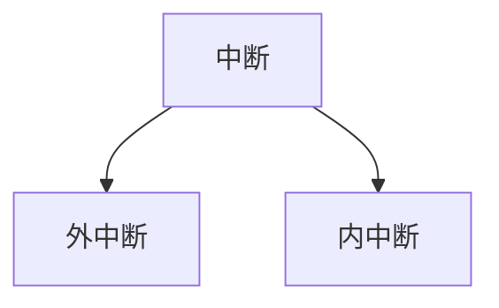
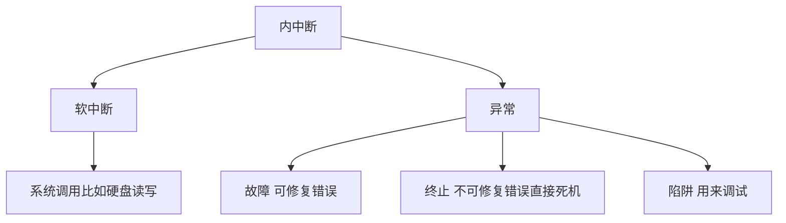

# 中断：


# 外中断：
## 1.中断过程

## 2.中断控制器的结构

## 3.icw初始化寄存器设置

## 4.idt描述符结构

## 5.idtr寄存器结构

```c
//标志位第10位为if位
//启用外中断sti
//关闭外中断cli
//1110中断门
//1111陷阱们


#define main_control_l 0x20//主中断控制器低位
#define main_control_h 0x21
#define slice_control_l 0xa0//片中断控制器低位
#define slice_control_h 0xa1
#define idt_size 256//向量表尺寸
```

# 内中断：




