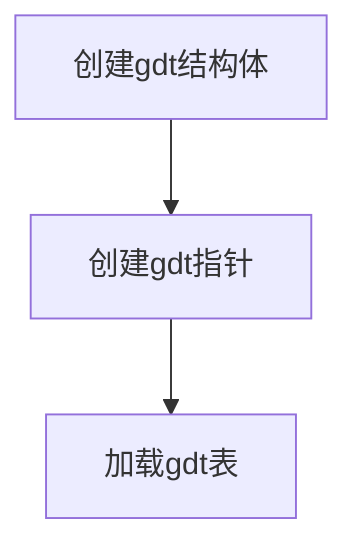

# 通过内核控制gdt有如下步骤：

#### 需要注意的是，由于c语言为了提高运行效率，会对字节进行对其操作，需要改用不对齐操作（结构体最后加 __attribute__ ((__packed__))）。之后内联汇编(asm volible("汇编代码"))

附：
GDT 结构图：

#### [Markdown官网](https://markdown.com.cn/ "超链接title")

gdt不只有代码段，数据段描述符，还有任务段描述符，等
## global table:

Base: A 32-bit value containing the linear address where the segment begins.

* Limit: A 20-bit value, tells the maximum addressable unit, either in 1 byte units, or in 4KiB pages. Hence, if you choose page granularity and set the Limit value to 0xFFFFF the segment will span the full 4 GiB address space in 32-bit mode.

* In 64-bit mode, the Base and Limit values are ignored, each descriptor covers the entire linear address space regardless of what they are set to.

* For more information, see Section 3.4.5: Segment Descriptors and Figure 3-8: Segment Descriptor of the Intel Software Developer Manual, Volume 3-A.

## access table:

* P: Present bit. Allows an entry to refer to a valid segment. Must be set (1) for any valid segment.

DPL: Descriptor privilege level field. Contains the CPU Privilege level of the segment. 0 = highest privilege (kernel), 3 = lowest privilege (user applications).

* S: Descriptor type bit. If clear (0) the descriptor defines a system segment (eg. a Task State Segment). If set (1) it defines a code or data segment.

* E: Executable bit. If clear (0) the descriptor defines a data segment. If set (1) it defines a code segment which can be executed from.

* DC: Direction bit/Conforming bit.

    + For data selectors: Direction bit. If clear (0) the segment grows up. If set (1) the segment grows down, ie. the Offset has to be greater than the Limit.

    + For code selectors: Conforming bit.If clear (0) code in this segment can only be executed from the ring set in DPL.If set (1) code in this segment can be executed from an equal or lower privilege level. For example, code in ring 3 can far-jump to conforming code in a ring 2 segment. The DPL field represent the highest privilege level that is allowed to execute the segment. For example, code in ring 0 cannot far-jump to a conforming code segment where DPL is 2, while code in ring 2 and 3 can. Note that the privilege level remains the same, ie. a far-jump from ring 3 to a segment with a DPL of 2 remains in ring 3 after the jump.

* RW: Readable bit/Writable bit.

    + For code segments: Readable bit. If clear (0), read access for this segment is not allowed. If set (1) read access is allowed. Write access is never allowed for code segments.

    + For data segments: Writeable bit. If clear (0), write access for this segment is not allowed. If set (1) write access is allowed. Read access is always allowed for data segments.

* A: Accessed bit. Best left clear (0), the CPU will set it when the segment is accessed.

## flage :

* G: Granularity flag, indicates the size the Limit value is scaled by. If clear (0), the Limit is in 1 Byte 
blocks (byte granularity). If set (1), the Limit is in 4 KiB blocks (page granularity).

* DB: Size flag. If clear (0), the descriptor defines a 16-bit protected mode segment. If set (1) it defines a 32-bit protected mode segment. A GDT can have both 16-bit and 32-bit selectors at once.

* L: Long-mode code flag. If set (1), the descriptor defines a 64-bit code segment. When set, DB should always be clear. For any other type of segment (other code types or any data segment), it should be clear (0).

## 对于任务描述符，局部描述符access的结构有些不同

access：

* Type: Type of system segment.
* Types available in 32-bit protected mode:

    + 0x1: 16-bit TSS (Available)
    + 0x2: LDT
    + 0x3: 16-bit TSS (Busy)
    + 0x9: 32-bit TSS (Available)
    + 0xB: 32-bit TSS (Busy)

