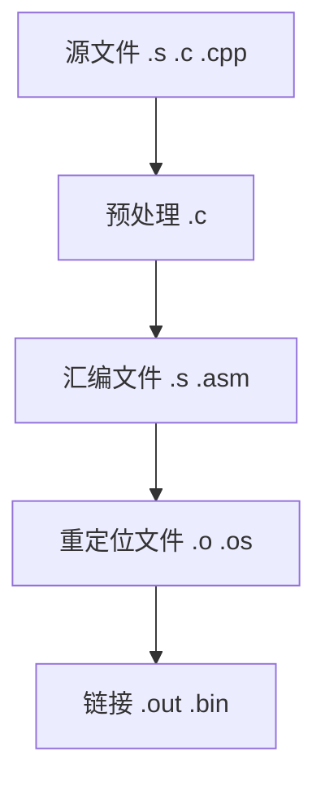

# 编译和链接c文件的过程：




其中.os为动态链库 ，.out为可执行文件

## 1.预处理 ---> test.c （宏展开等操作完成后的文件）

```shell
gcc -m32 -E main.c -I/home/heige/source/include/ >test.c
```

## 2.生成汇编文件 ----> test.s （由c文件生成对应的汇编文件）
```shell
gcc -m32 -S test.c > test.s
```

## 3.生成重定位文件 ----> test.o  (生成可重定位文件可以与与kner.bin进行链接)
```shell
as -32 test.s -o test.o
```
## 4.链接生成可执行文件 
```shell
ld -m elf_i386 -static test.o -o test.out -e init_kneral


（-e 是文件的起始位置）
```

//如果链接报错
```shell
ld: test.o: in function `init_kneral':
test.c:(.text+0x73): undefined reference to `__stack_chk_fail_local'
ld: test.out: hidden symbol `__stack_chk_fail_local' isn't defined
ld: final link failed: bad value
```
是由于define宏定义在连接时候不能跨文件使用 因此将define定义的参数设置为int，char类的


## gcc整合上述步骤简化为：
gcc -m32 -g -I../include -c main.c -o test.o

# Makefile的修改与添加:
```Makefile

canshu := -m32                       #32位
canshu += -nostdinc                  #不使用标准头文件
canshu += -nostdlib                  #不使用标准库
canshu += -fno-pic                   #不使用地址可变
canshu += -fno-pie
canshu += -fno-builtin               #不使用链接文件
canshu += -fno-stack-protector       #不使用栈保护
canshu := $(strip $(canshu))
debug += -g                         #启用调试
include += -I                       #头文件的地址
$(build)/kneral/%.o : $(kneral)/%.c
	mkdir -p $(build)/kneral/
	gcc $(canshu) $(debug) $(include)../include -c $< -o $@
$(build)/kneral/kneral.bin : $(build)/kneral/kneral.o \
	$(build)/kneral/main.o 

	ld -m elf_i386 -static $^ -o $@ -Ttext $(entrypoit)

```

# 将kneral引导到inti_kneral函数里面：
```s
extern init_kneral  ;声明函数在另一个文件里
global start        ;声明start在链接时指定内核从这里开始
start:
    call init_kneral
```

# gcc将c文件转为汇编文件，进行调试

gcc
-fno-pic  //不需要位置移动（可重定位）的代码
-Qn //去除gcc的版本信息
-mpreferred-stack-boundary= //去除栈对齐代码
-fno-asynchronous-unwind-table  //去除汇编中记录函数错误信息的代码


### 至此便可进入c语言编写

